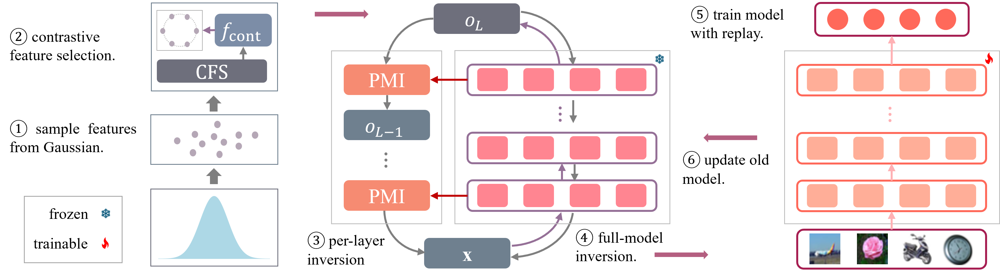

# Model inversion with layer-specific modeling and alginment for data-free continual learning

## Abstract 

Continual learning (CL) aims to adapt a model to a sequence of tasks while maintaining performance on previously seen ones. Despite their effectiveness in mitigating forgetting, data storage and replay are often infeasible due to privacy or security constraints, and are impractical or unavailable for arbitrary pre-trained models. Data-free CL aims to continually update models with new tasks without storing previous data. Model inversion enables data generation by extracting knowledge from a trained model, allowing replay of previous tasks without stored data. However, model inversion faces two key challenges. Inversely generating data, e.g., images, solely from highly-compressed class labels leads to feature drift between synthetic and real data, causing forgetting of real image knowledge after replay and degrading inversion quality in subsequent stages. And performing inversion is usually computationally expensive, as each iteration requires backpropagation through the full model and many steps are needed for convergence. These problems are more severe in \textcolor{orange}{pre-trained} foundation models such as Contrastive Language-Image Pre-training (CLIP) models. To improve model inversion efficiency, we propose Per-layer Model Inversion (PMI) approach inspired by the faster convergence of single-layer optimization. The inputs optimized from PMI provide strong initialization for full-model inversion, significantly reducing the number of iterations required for convergence. To address feature distribution shift, we model class-wise feature distribution using a Gaussian distribution and preserve distributional information with a contrastive model. Sampling features for inversion ensures alignment between synthetic and real feature distributions. Combining PMI and feature modeling, we demonstrate the feasibility of adapting models to new classes by generating data from pseudo image features mapped through semantic-aware feature projection. Our method shows strong effectiveness and compatibility across multiple CL settings.

## Code

Implementation code of our paper will be available soon.

